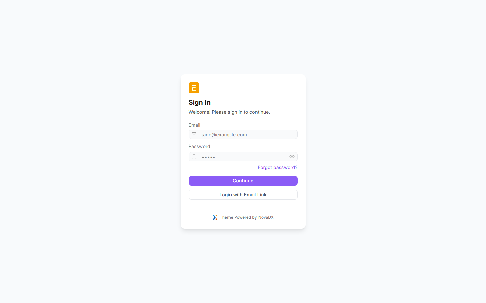
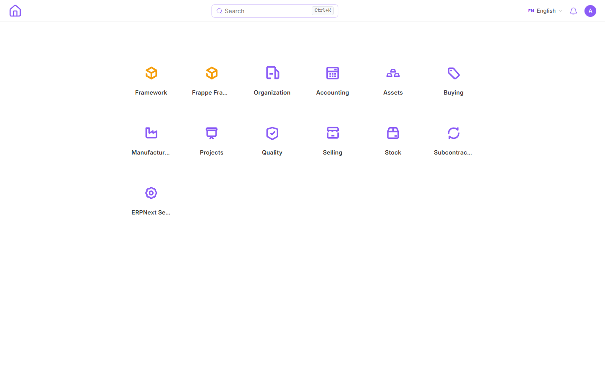
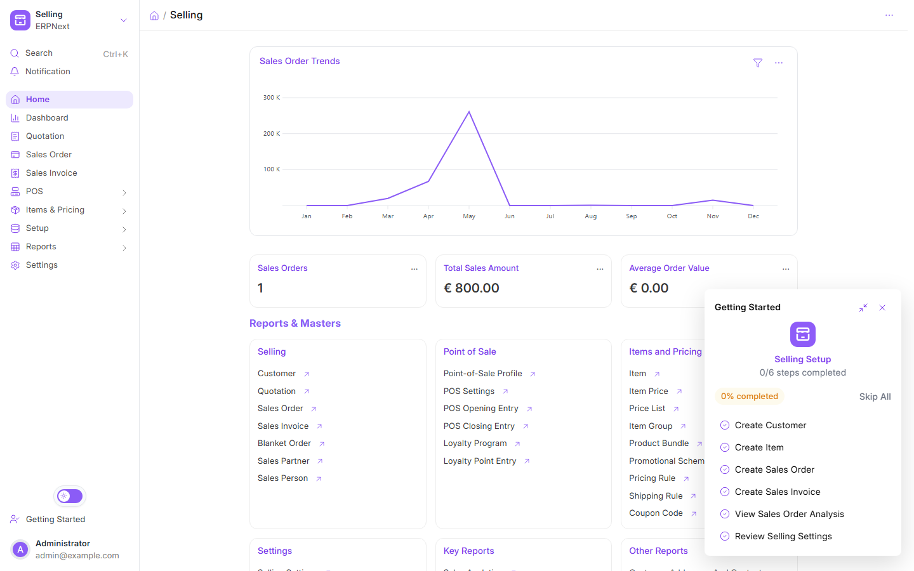
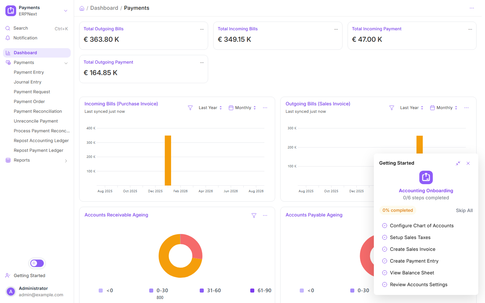
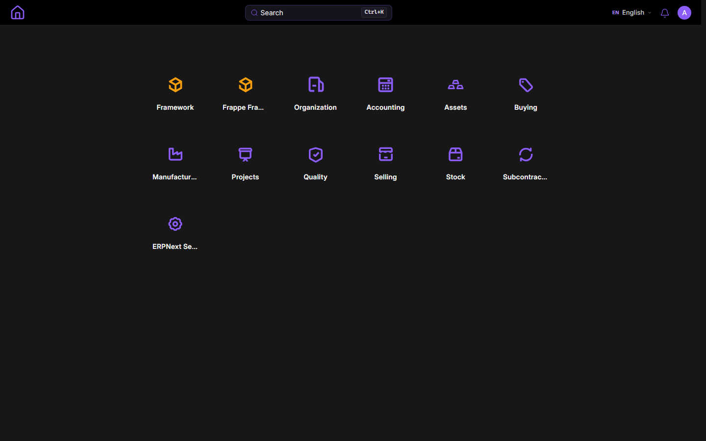
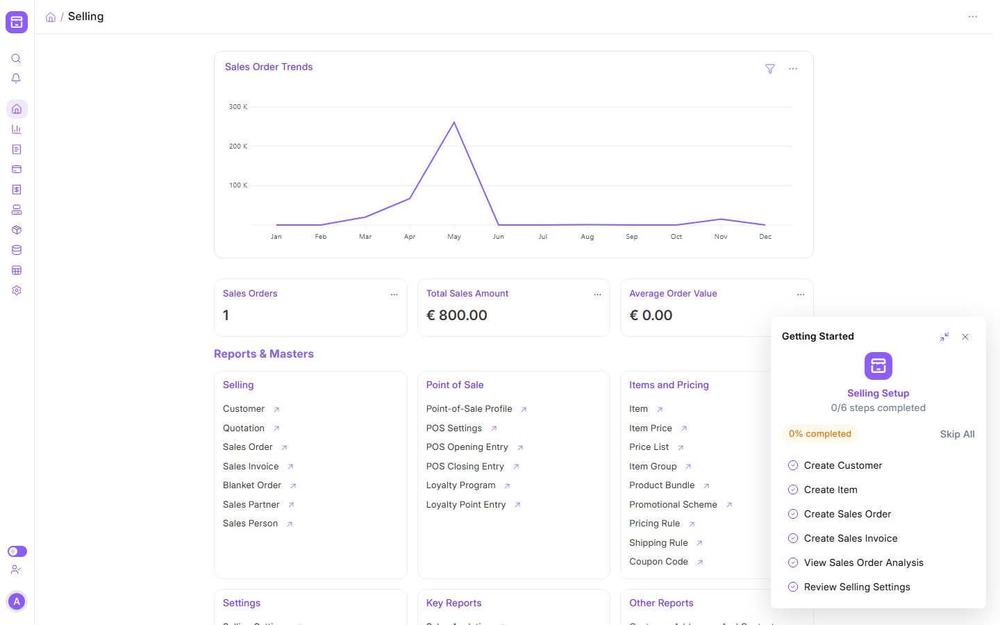

# VeluNext

A modern visual theme for ERPNext/Frappe — branding, colors, typography, and micro-interactions applied to the Desk, the login screen, and the Customer Portal, while staying fully compatible with core (no native Frappe/ERPNext file is modified).

Built by [NovaDX](https://novadx.pt) for its ERPNext instances.

**Current version:** 1.1.0

## Screenshots

| | |
|---|---|
| **Login** | **Desk (Home)** |
|  |  |
| **Workspace (Selling)** | **Dashboard (Payments)** |
|  |  |
| **Dark mode** | **Collapsed sidebar** |
|  |  |

## Brand identity

| | |
|---|---|
| Primary color (purple) | `#8B5CF6` |
| Secondary color (amber) | `#F59E0B` |

## Features

### Desk

- Sidebar, forms, lists, checkboxes, dashboards, and charts consistently recolored to the brand palette, without touching any native file (everything injected via the app's own CSS/JS).
- Module icons on the Home screen shown as plain brand-colored glyphs (no background), revealing the solid colored square + white icon on hover.
- Donut/pie charts (e.g. *Accounts Receivable Ageing*) using a purple→amber gradient consistent with the brand, keeping red on the most critical bucket as a deliberate warning signal.
- Navbar language switcher (flag/code + language name), reusing Frappe's native mechanism (`User.language`) without introducing any new capability.
- Navbar search field with a visible border and a brand-colored icon.
- Light/dark mode toggle, persisted per user (Frappe's native mechanism).
- Full dark mode support across every custom component.

### Login / Authentication

- Centered, modern login card with styled inputs and buttons.
- Favicon and "Theme Powered by NovaDX" credit.

### Customer Portal

- Portal sidebar, listing cards, status badges, and forms (e.g. ticket creation) redesigned.
- Navigation icons injected dynamically per route.
- "Theme Powered by NovaDX" footer on portal pages.

## Installation

```bash
bench get-app velunext git@github.com:sun2dayo/velunext.git
bench --site <site-name> install-app velunext
bench --site <site-name> clear-cache
bench build --app velunext
```

## Project structure

```
velunext/
├── hooks.py                  # app_include_css/js, web_include_css/js
├── public/
│   ├── css/                  # modern_desk_sidebar.scss, modern_login.scss, modern_portal.scss
│   ├── js/                   # theme_toggle.js, desk_language_switcher.js, desk_module_icons.js, ...
│   └── images/               # icons and assets recolored for the brand
├── templates/
└── www/
```

## Development

- Working branch: `develop`. Changes only reach `main` when a development phase is finished.
- Whenever a native color/icon needs changing, the goal is to reuse an existing Frappe mechanism (CSS variables, `content: url()`, hooks) instead of patching core files — so `bench update` never wipes out the theme.

## License

MIT — see [license.txt](license.txt).

---

Copyright (c) 2026, [NovaDX](https://novadx.pt) &lt;odaio@novadx.pt&gt;
